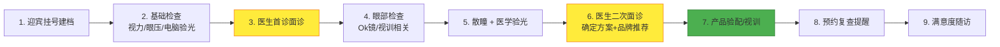
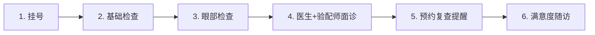
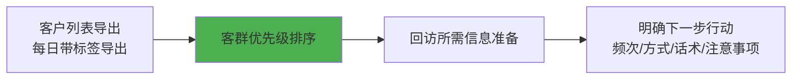
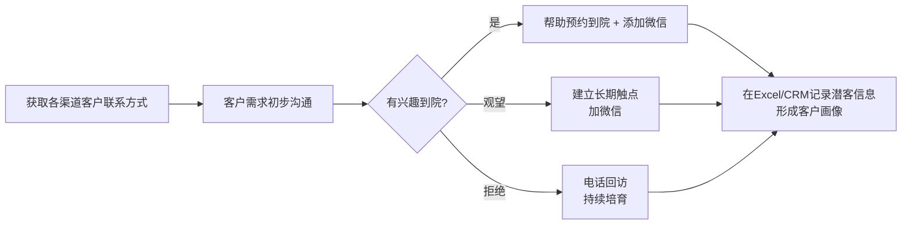
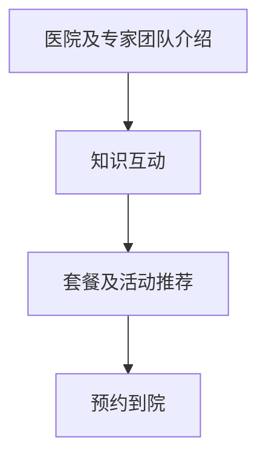
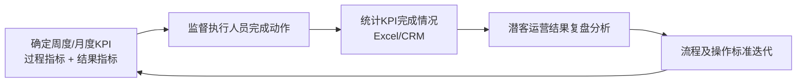

# 院内服务和客户运营

**主讲人**：广州某眼科集团总院长  
北京首大眼耳鼻喉眼科院长  
郑州普瑞眼科医院院长

---

## 目录

1. [院内服务标准化流程](#01-院内服务标准化流程)
   - 1.1 迎宾挂号建档环节
   - 1.2 基础检查环节
   - 1.3 医生首诊环节
   - 1.4 眼部检查与散瞳环节
   - 1.5 医生二次面诊环节
   - 1.6 产品验配与视训环节
   - 1.7 预约复查提醒环节
   - 1.8 客户满意度随访环节
2. [院内服务升级-工具包](#02-院内服务升级-工具包)
   - 流程卡设计示例
3. [已有客户运营-流程](#03-已有客户运营-流程)
   - 3.1 制定回访计划
   - 3.2 执行回访计划
   - 3.3 流失/停戴客户管理
4. [已有客户运营-工具包](#04-已有客户运营-工具包)
   - 已有客户数据管理
5. [潜在客户运营-流程](#05-潜在客户运营-流程)
   - 5.1 客户初步沟通
   - 5.2 潜客分群与长期培育
   - 5.3 潜客运营管理

---

## 01 院内服务标准化流程

### 院内服务流程关键环节（总览）

**新客户（未配镜客户）完整9步流程**：

**已配镜客户复查简化流程**：

**核心原则**：  
**全力以赴，不一定会成功；不全力以赴，一定不会成功**  
**转化关键环节**：医生首诊（第3步）、医生二次面诊（第6步）、产品验配（第7步）

---

### 1.1 迎宾挂号建档环节

**诊疗流程拆解**：
1. 迎宾，询问就诊诉求
2. 分诊挂号
3. 建立纸质档案（病历本）+ 电子档案（系统上线后）
4. 介绍视光专家特色
5. 指引就医者至视光科室

**动作执行人**：导医

**服务注意事项**：
- 挂号前充分沟通就诊诉求，明确检查套餐
- 主动迎接，态度热情，全程面带微笑
- 树立视光科室及专家专业度形象

**示例话术**：
- “您好，请问有预约吗？”
- “小朋友的姓名是什么？”
- “今天过来主要希望帮助检查什么问题？”

**指引细节**：交接患者至视光师，进行检查沟通。

---

### 1.2 基础检查环节

**诊疗流程拆解**：
1. 迎接患者，采集病历，排好顺序
2. 简单介绍基础检查内容
3. 测视力、眼压、电脑验光
4. 填写检查数据至纸质档案
5. 引导就医者至医生诊室，协助取号

**动作执行人**：前端护士

**服务注意事项**：
- 主动迎接，态度热情，全程面带微笑
- 主动向家长介绍检查项目内容、目的、检查结果
- 快速准确完成基础检查

**示例话术**：
> “您好，我是xx，我们现在进行医生面诊前的基本检查，方便医生后续高效诊断。我会按先后顺序给大家逐一检查。”

---

### 1.3 医生首诊环节（转化关键环节）

**诊疗流程拆解**：
1. 问询就医者主诉，态度亲和建立信任
2. 裂隙灯检查、眼位检查
3. 开具诊断，简单科普不同诊疗方案，咨询偏好
4. 初步判断支付能力，给出初步推荐，开具相关检查
5. 缴费，发放就诊流程卡
6. 指引至下一目的地
7. 协助医生传达医嘱，科普答疑，提升转化

**动作执行人**：视光门诊医生（主诊） + 客服（辅助）

**服务注意事项**：
- 态度亲和，缓解小朋友恐惧
- 体现专业度，结合诊疗需求 + 家庭经济能力综合判断
- 建立家长信任

**诊疗方案沟通重点**（高/中/低经济能力分层推荐）：
- **高经济能力**：侧重 Ok镜（最好最贵品牌）
- **中等**：同时介绍 Ok镜 + 离焦眼镜
- **低**：离焦眼镜 + 普通框架镜

---

### 1.4 眼部检查与散瞳环节

**眼部检查**（前端护士）：
- Ok镜相关检查（角膜地形图、眼轴测量、综合验光等）
- 准确高效，缓解恐惧

**散瞳**（客服 + 验光师）：
- 根据年龄/意愿选择快/中/慢散（补收药水费）
- 散瞳后医学验光
- 多次关怀，缓解恐惧

**服务注意事项**：
- 与医生初步方案保持一致
- 进一步判断经济承受能力与方案倾向性，为医生二次面诊做铺垫
- 不做具体产品/品牌推荐

---

### 1.5 医生二次面诊环节（转化关键环节）

**诊疗流程拆解**：
1. 二次诊疗方案沟通（结合检查结果 + 经济能力）
2. 客户科普、风险、疗效介绍
3. 确定诊疗方案及品牌推荐（体现“定制化”）
4. 告知复查时间，录入提醒模块
5. 协助指引至产品验配
6. 传达医嘱，科普答疑

**动作执行人**：视光门诊医生（主） + 客服（辅助）

**推荐策略**（基于支付意愿）：
- 高支付意愿 + 眼部条件正常 → 高单价 Ok镜品牌
- 较高支付意愿但有价格顾虑 → 中端 Ok镜
- 支付意愿适中或不适配 Ok镜 → 高单价离焦镜片
- 支付意愿较低 → 中端离焦镜片或普通框架眼镜

**核心话术要点**：
- 再次强调不干预后果
- 突出“定制化”诊疗方案
- 强调安全性和疗效数据（国家指南、集采政策支持）

---

### 1.6 产品验配与视训环节

**Ok镜验配流程**：
角膜地形图、验光 → 产品科普/品牌介绍 → 试戴评估 → 签订告知书、缴费 → 收预售单 + 加企业微信 → 到镜后预约取镜 → 取镜日：摘带/保养宣教 → 定期复查结果解读 → 戴镜回访

**离焦/框架镜验配流程**：
离焦镜片科普 → 选镜框镜片 → 测瞳高/瞳距 → 验配成功、缴费 → 产品摘带/保养宣教 → 戴镜回访

**视训流程**：
视训科普 + 仪器使用说明 → 试用 → 开设账号 + 家庭视训宣教 → 加企业微信 → 缴费

**动作执行人**：
- Ok镜：OK镜验配师
- 框架：框架镜配镜师
- 视训：视训师
- 跟诊/回访：客服

**服务核心**：
- 与医生判断完全一致
- 耐心科普，解答疑问
- 强调安全性和长期效果

**示例话术**（Ok镜）：
- “Ok镜已被纳入国家青少年近视防控临床指南，河北省已纳入集采范围，安全性和疗效获得广泛认可。”
- “现场试戴即可看到即时效果，长期佩戴防控效果更明显。”
- “加企业微信，佩戴中任何问题随时联系，售后质保无忧。”

**新增提示**：初诊/首次复查推荐大众点评/有赞复查套餐（3次/199元），视情况执行。

---

### 1.7 预约复查提醒环节

**诊疗流程拆解**：
1. 迎接完成验配/视训患者至总台
2. 确认电子健康档案完整性（姓名、年龄、联系方式、就诊目的、医生处方、诊疗产品）
3. 问询满意度 + 预告随访
4. 加客服企业微信
5. 确认复查日期并录入提醒系统
6. 提醒关注视频号
7. 指引离开
8. 当天下班前将电子病历发至家长（公众号关联）

**复查频率**：
- **Ok镜**：1天、1周、2周、3周、1个月、每3个月
- **框架镜（含离焦）**：1个月、3-6个月
- **视训**：一个疗程为单位

**送宾细节**：
- 一手指引，一手按电梯，微笑目送
- 科室在一层时护送至出口附近

**话术示例**：
> “您好，请把您的病历给我，帮您登记录入复查日期。方便您直接到院复查，减少排队。小朋友眼睛在发育阶段变化非常快，按时复查对视力防控达到最佳效果至关重要。我们会在临近日期电话提醒。”

---

### 1.8 客户满意度随访环节

**随访分群**：

| 类型 | 时效 | 核心目的 | 执行人 |
|------|------|----------|--------|
| 1. 现场表达不满意 | 就诊次日上午 | 详细了解诉求，提供解决方案 | 客服 |
| 2. 常规随访（未表达不满意） | 就诊3-7天内 | 收集满意度反馈，提升服务 | 客服 |

**不满意处理流程**：
1. 记录完成随访
2. 院内服务当事人沟通
3. 鉴别问题合理性
4. 电话随访客户，给出解决方案
5. 3天内二次致电回复

**日常/季度机制**（新增）：
- 每日抽查20%
- 每季度群发满意度调查（系统自动发送）
- 不定期门口设置问卷（二选一）

**执行人**：客服 + 视光运营主任

---

## 02 院内服务升级-工具包

### 流程卡设计示例

**无锡客户就诊流程卡**（示例）

| 检查流程 | 楼层、房间号 |
|----------|--------------|
| 挂号建档 | X楼、XX号 |
| 基础检查 | X楼、XX号 |
| 医生面诊 | X楼、XX号 |
| 眼部检查 | X楼、XX号 |
| 散瞳 | X楼、XX号 |
| 医生面诊 | X楼、XX号 |
| 产品验配 | X楼、XX号 |

**东区视光就诊流程卡**（示例，含详细检查项目）

**视光就诊流程卡**  
姓名 | 年龄 | 医生

**内容** | **检查内容** | **已执行** | **检查内容** | **已执行**
---|---|---|---|---
基础检查 | 眼健 | □ | 眼压 | □
 | 视力 | □ | 角膜曲率测量 | □
 | 电脑验光 | □ | ... | ...
眼部检查 | 医学验光（普通/精准） | □ | 眼底检查 | □
 | 四合一眼前节分析 | □ | 散瞳（快/中/慢） | □
医生面诊 | 医生首诊 | □ | 裂隙灯检查 | □
散瞳后 | 散瞳后医学验光 | □ | ... | ...
眼部检查 | 角膜地形图（TOMEY） | □ | 泪膜破裂时间测定 | □
医生面诊 | 医生确定治疗方案 | □ | ... | ...

**温馨提示**：
1. 勾选项目均需检查，如排队时间长请耐心等待。
2. 表格方框由医护人员勾选，请勿自行打√。

---

## 03 已有客户运营-流程

### 3.1 制定回访计划

**回访计划制定流程**：

**客户优先级排序（6级）**：

| 客群分类 | A类 | B类 | 跟进岗位 |
|----------|-----|-----|----------|
| **已配镜客户** | 介绍会员量≥1 | 普通客户 | 客服、角塑验配师/配镜师 |
| **正常随诊** | 远视储备100度以内（高危） | 远视储备100度以上及其他 | 客服 |
| **流失客户** | 有联系但无明确就诊意愿 | 失联/明确拒绝 | 客服 |

**行动方向建议**：
- **已配镜-A**：专属/优先活动沟通 + 预约 + 生日礼（高值客户优先）
- **已配镜-B**：日常答疑 + 复诊提醒 + 体验反馈收集
- **正常随诊-A**：专属活动 + 生日礼
- **流失-A**：及时随访记录原因 + 大力度促活活动
- **流失-B**：长期定时沟通

**生日礼**：为OK镜、离焦镜、哺光仪客户和高潜力随诊客户发放（集团统一定制，有logo）。

---

### 3.2 执行回访计划

#### 3.2.1 就诊体验反馈收集（到院当天或3天内）

**形式**：院内加微信后私信发送

**话术示例**：
> “XX家长您好，我是新视界眼科护士XX，我们对您和小朋友的就诊体验做下回访。您在我们院就诊下来各方面还满意吗？不知道您这边有没有什么反馈和建议呢？”

**关键点**：及时（最晚一周内）、内容简短、以解决反馈为主。

#### 3.2.2 复查提醒 & 回访

**形式**：到诊前3天短信自动提醒 → 先微信 → 无回复则电话跟进

**OK镜复查频率**：
- 配镜中 / 戴镜第1天 / 1周 / 1个月 / 每3个月

**框架镜复查频率**：
- 配镜后第4天 / 戴镜3天 / 1个月（有不适客户）

**话术要点**：关怀 + 适应情况收集 + 复查提醒 + 预约确认 + 就诊提醒（提前一天）。

#### 3.2.3 活动沟通及预约

**活动类型 & 话术**：
- **老带新**：会员积分 + 入会礼（小XX）
- **优惠/福利**（生日、节日、转发，<50元）：复诊时介绍或回访提及
- **线下活动**（团建、科普）：流失客户促活、已配镜会员福利

#### 3.2.4 其他日常沟通事项

- **日常问题解答**：半天内回复，最晚当天
- **生日/节日问候**：当天发送 + 抵用券
- **暂时停戴**：询问原因 → 并发症则提醒一周复查；生病则关心恢复

---

### 3.3 流失/停戴客户管理

**周期**：流失第二天第一次，每周联系一次（视情况跟进）

**OK镜流失原因 & 解决方案**：
- **价格顾虑**（碎/丢片费用高）→ 介绍性价比 + 活动时重点回访
- **使用顾虑**（嫌麻烦、不适应）→ 检查数据分析 + 耐心告知安全性
- **疗效顾虑**（控制效果不好、担心安全性）→ 耐性告知 + 院内统计数据
- **正常停戴**（过体检、成年、换方案）→ 交叉销售（框架/RGP/屈光手术）

**框架镜流失原因 & 解决方案**：
- 价格顾虑、款式太少、认知不足、观望 → 送检查套餐 + 与眼镜店差异化 + 加微信长期培育
- 较难挽回（熟人/网络渠道）→ 加微信长期培育

**话术**：先了解原因 → 提供解决方案 → 记录下次跟进计划。

---

## 04 已有客户运营-工具包

### 已有客户数据管理

**当前数据来源（5个）**：
1. HIS系统（基本信息 + 收费明细）
2. CRM系统（渠道来源 + 预约）
3. 每日就诊记录表（诊断、转化、流失原因）
4. 产品记录表（购买、跟进、复购）
5. 纸质就诊档案（历史检查）

**问题**：数据分散、不一致、Excel难以处理 → 系统性客户运营难。

**优化目标**：结构化就诊信息 + 院后服务记录 → 自动生成**客户生命周期标签**（6级优先级）。

**数据内容**：
- **到院就诊信息**：基本信息 + 就诊记录 + 购买/产品信息 + 行为数据
- **院后服务记录**：行动/服务计划 + 服务记录（满意度、复诊意愿、流失原因）
- **记录频次**：每次到院 + 每次院后触点 → 自动生成标签

---

## 05 潜在客户运营-流程

### 5.1 客户初步沟通-流程

**核心流程**：

**沟通重点**：
- 了解基本信息（疾病类型、近视防控需求）
- 了解认知度及急迫度
- 下一步动作：引导预约/加微信

---

### 5.2 潜客分群与长期培育-流程

**潜客分群**（基于眼健康认知 + 需求急迫性）：
1. **刚需型**（高急迫 + 高认知）：会员推荐，已在其他机构就诊过
2. **急迫型**（高急迫 + 低认知）：自然流量/电商，突然发现问题
3. **观望型**（低急迫 + 高认知）：会员/内容平台，近视进展慢
4. **入门及焦虑型**（低急迫 + 低认知）：竞价/官网，焦虑但需求不迫切

**长期培育四大关键行动**：

**详细行动**：
- **刚需型**：扫清“最后一公里”障碍，凸显专业性（不推荐具体医生）
- **急迫型**：深入痛点互动 + 适时活动/套餐撬动
- **观望型**：长期伙伴关系（专业+关怀），以“拉”为主
- **入门焦虑型**：专业科普缓解焦虑 + 活动撬动 + 推荐名医预约

**医院及专业团队介绍场景**：点对点沟通、医生答疑问诊群、内容平台医生包装。

**知识互动**：线上科普（内容创作 + 激励机制） + 线下活动（亲子、小小医生、家长讲座）。

**套餐/活动推荐**：电商平台（门槛型 + 季节性）、公众号/1v1（内容导向 + 高复购护理液）、线下（异业联名）。

---

### 5.3 潜客运营管理-流程

**运营管理闭环**：

**KPI制定**：与事业部对齐，匹配到具体岗位。

**复盘**：分析未达标原因 → 优化流程 → 下一周期落地。

---

## 文档说明（更新版）

- 本MD已完整覆盖原51页PDF所有核心内容
- 所有关键流程均使用 **Mermaid 流程图** 直观呈现（可直接复制到支持Mermaid的平台渲染）
- 表格、话术、策略、注意事项全部结构化保留
- 适用于院内培训、SOP手册、运营参考手册

**版权**：内容来源于原PPT（Copyright © 2021 by Boston Consulting Group / 眼科集团内部资料）

---

*生成时间：2026年4月23日*  
*已完整补全所有章节！如需导出PDF、Word、添加图片或进一步定制，请随时告诉我！*