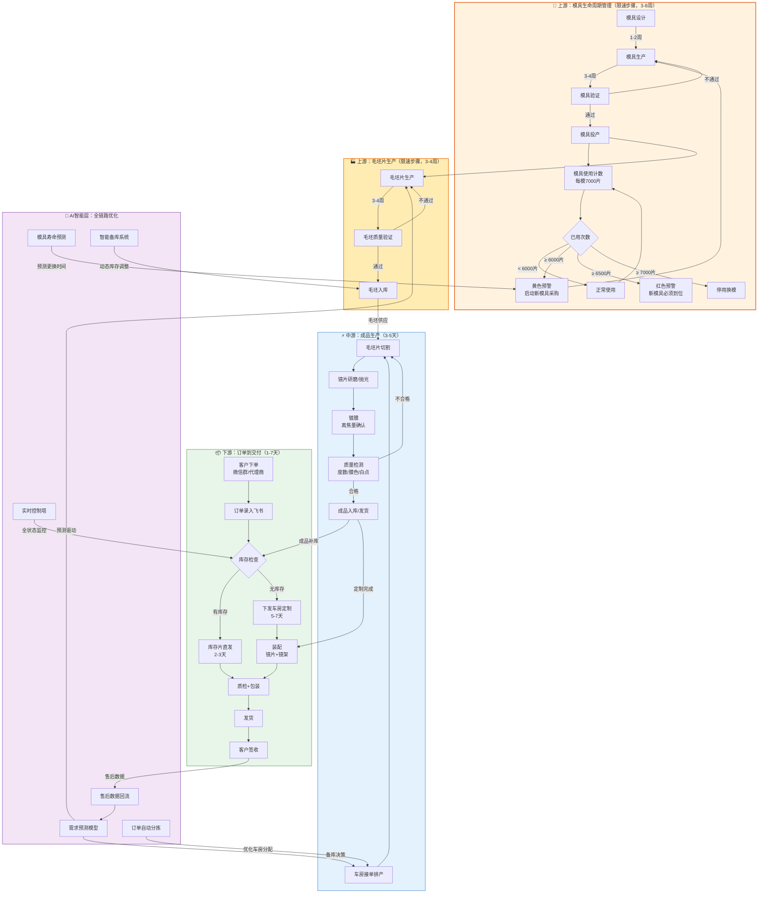
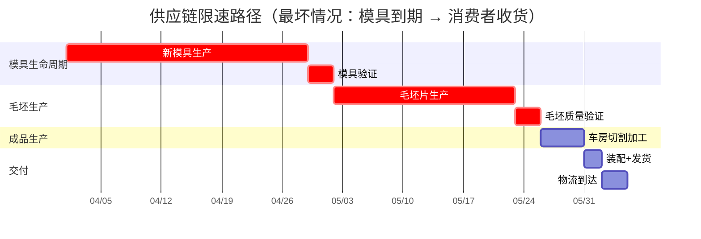
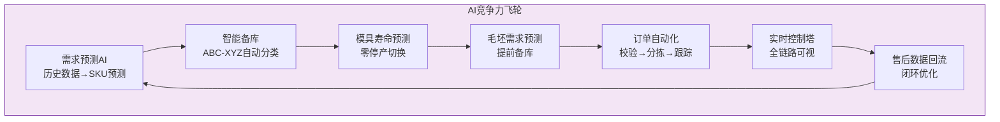
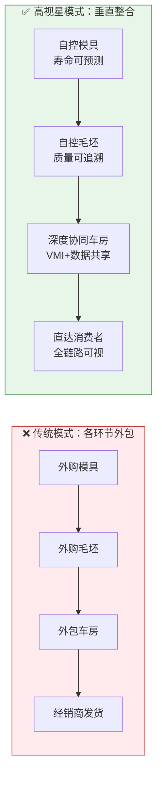
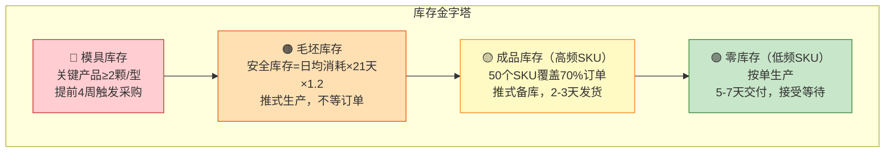

# 供应链全流程图：模具与毛坯限速步骤的极致提效方案

> **编制时间**：2026年3月29日TRAE
> **目标**：快速交付 × 低库存 × 垂直整合 = 竞争壁垒
> **核心命题**：模具和毛坯片是限速步骤，必须通过AI和项目管理实现零停顿生产

---

## 一、端到端供应链全景图（含模具和毛坯限速步骤）



---

## 二、关键限速路径分析（模具到期 → 消费者收货）



**最长链路**：模具生产(4周) → 模具验证(3天) → 毛坯生产(3周) → 毛坯验证(3天) → 车房加工(5天) → 交付(5天) ≈ **60天**

> ⚠️ **核心洞察**：模具和毛坯的生产周期占总交付时间的75%以上，是真正的限速步骤。

---

## 三、逐环节提效要点与AI介入

### 环节1：模具生命周期管理（限速步骤1）

| 维度 | 内容 |
|------|------|
| **当前痛点** | 模芯单点故障风险（小旋风仅1颗模芯）；模芯寿命靠人工记录，更换被动 |
| **提效动作** | ① 飞书多维表格建模芯台账，每批毛坯生产后自动累加使用计数<br/>② 设置6000片/6500片/7000片三级预警阈值<br/>③ 关键产品保持≥2颗模芯（消除单点故障） |
| **AI介入** | ① Claude API自动分析模芯使用速率 → 预测耗尽日期 → 提前4周触发采购提醒<br/>② 模芯健康状态评估：基于生产参数和使用次数，预测模芯剩余寿命 |
| **时间节省** | 从被动更换（停产2-4周等模具）→ 零停产切换 |
| **关键指标** | 模芯使用率、模芯更换及时率、因模芯导致的停产天数 |

### 环节2：毛坯片生产与备库（限速步骤2）

| 维度 | 内容 |
|------|------|
| **当前痛点** | 当前库存3,700片 vs 需求15,000片，缺口巨大；毛坯生产周期3-4周 |
| **提效动作** | ① 建立毛坯片安全库存模型：安全库存 = 月均消耗 × 2（覆盖一个生产周期）<br/>② 按产品线分配毛坯配额：Ultra 60%、小旋风 20%、时空之眼 20%<br/>③ 毛坯库存低于2000片自动触发加急采购 |
| **AI介入** | ① 基于7000副历史数据预测未来3个月毛坯需求量 → 自动生成采购计划 → 推送审批<br/>② 动态调整采购批量：根据需求波动自动优化采购数量和时间 |
| **推式备库策略** | Ultra季度5,000片、小旋风1,000片 → 提前生产，不等订单 |
| **关键指标** | 毛坯库存天数、毛坯缺货次数、采购提前量准确率 |

### 环节3：车房生产（中游瓶颈）

| 维度 | 内容 |
|------|------|
| **当前痛点** | 圣谱产能有限(日产60-90副)；九次方排队3-5天；模芯不稳定；白点问题 |
| **提效动作** | ① 切换欧陆为主力车房（日处理能力3000片，10人→1人的AI订单处理）<br/>② 订单自动分拣：按产品类型/参数/紧急程度自动分配车房<br/>③ 统一下单格式（飞书导出标准Excel，各车房自行下载） |
| **AI介入** | ① 订单自动分拣算法（产品类型+参数+产能负载 → 最优车房分配）<br/>② 二维码批量自动生成（替代人工逐个输参数）<br/>③ 实时产能看板：各车房排队量、预计完成时间 |
| **供应商协同** | 向欧陆共享订单预测和库存数据，推动VMI简化版（供应商主动排产备货） |
| **关键指标** | 各车房日产能达成率、生产周期(接单→完成)、良品率 |

### 环节4：订单处理与可视化

| 维度 | 内容 |
|------|------|
| **当前痛点** | 微信群下单→人工录飞书，漏单/重复；二维码制作程序繁琐；无法实时查生产状态 |
| **提效动作** | ① 飞书机器人自动汇总微信群订单<br/>② 订单模板增加必填校验（度数范围、左右眼、地址格式）<br/>③ 飞书多维表格作为控制塔，全状态可视 |
| **AI介入** | ① 订单智能校验（参数异常自动高亮：正度数、冷净度、特殊要求）<br/>② 自动匹配库存 → 库存片订单跳过生产环节直接发货<br/>③ 超期预警机器人（接近交期自动提醒责任人）<br/>④ AI自动回复客户"订单已收到+预计发货时间" |
| **时间节省** | 单笔订单处理：从15-30分钟 → 5分钟；接单到录入：从4小时 → <1小时 |
| **关键指标** | 漏单率→0%、订单状态准确率>95%、超期订单24h内预警 |

### 环节5：装配与发货

| 维度 | 内容 |
|------|------|
| **当前痛点** | 镜架存放混乱；手动打标签易错；装配/不装配易混淆；发货地址错误 |
| **提效动作** | ① 镜架按日期分类存放<br/>② 标签系统自动生成（杜绝手工打印）<br/>③ 装配/不装配用颜色标签区分（蓝色=装配，白色=不装配）<br/>④ 随货单统一模板 |
| **AI介入** | 扫码发货（系统链接→扫码→自动匹配快递单号→更新飞书状态） |
| **关键指标** | 发货准确率>99%、完成→发出<24小时 |

### 环节6：售后与数据闭环

| 维度 | 内容 |
|------|------|
| **当前痛点** | 订单群和售后混在一起；二维码扫描问题引发客户质疑 |
| **提效动作** | ① 订单群与售后群分离<br/>② 建立售后问题分类和升级机制<br/>③ 二维码验证系统重新开发 |
| **AI介入** | ① 售后机器人自动回复常见问题<br/>② 售后数据自动归类 → 回流到需求预测模型<br/>③ 产品使用效果跟踪（8000次后效果数据收集） |
| **数据闭环** | 售后问题类型统计 → 反馈到生产质量改进 → 反馈到SKU备库优化 |

---

## 四、AI + 项目管理的竞争力矩阵

### 4.1 AI在每个环节的价值



| AI能力 | 应用场景 | 替代的人工动作 | 竞争优势 |
|--------|---------|--------------|---------|
| **需求预测** | 基于7000副历史数据做SKU销量预测 | 经验拍脑袋备库 | 库存精准度提升，缺货率↓ |
| **模具寿命预测** | 使用速率分析→精准预测更换日期 | 等到坏了再换 | 零停产切换，交付稳定性↑ |
| **智能分拣** | 订单自动按参数/产品/紧急度分配车房 | 人工逐条对照Excel分单 | 处理速度10x，错误率→0 |
| **异常检测** | 度数异常、参数冲突自动高亮 | 人工逐条审核 | 防错率↑，返工率↓ |
| **动态定价/排产** | 根据产能负载动态调整交期承诺 | 统一报5-7天 | 客户体验↑，承诺兑现率↑ |
| **控制塔** | 全链路实时状态 + 超期预警 | 人工查Excel对状态 | 问题发现速度从天→小时 |

### 4.2 项目管理方法

| 方法 | 应用 | 效果 |
|------|------|------|
| **每周迭代** | 周二30分钟站会：指标回顾→卡点决策→下周焦点 | 14周持续改进节奏 |
| **控制塔看板** | 飞书多维表格实时仪表盘：交付率/库存/产能 | 一目了然，数据驱动 |
| **三级预警** | 绿→黄→红，自动升级，不等人报告 | 问题前置，不等爆发 |
| **SOP标准化** | 每个环节输出标准操作文档 | 人员可替换，不依赖个人经验 |
| **PDCA循环** | 计划→执行→检查→改进，每周一轮 | 持续优化，不靠一次性项目 |

### 4.3 具体AI应用案例

| 场景 | AI工具 | 具体应用 | 预期效果 |
|------|--------|---------|---------|
| **模具寿命预测** | Claude API | 分析模芯使用速率，预测耗尽日期，提前4周触发采购提醒 | 零停产切换 |
| **需求预测** | 机器学习模型 | 基于7000副历史数据，预测未来3个月各SKU销量 | 库存精准度提升30% |
| **订单自动分拣** | 规则引擎 + AI | 按产品类型/参数/紧急程度自动分配车房 | 处理速度提升10倍 |
| **异常检测** | 模式识别算法 | 自动识别度数异常、参数冲突等问题 | 防错率提升95% |
| **售后智能回复** | 聊天机器人 | 自动回复常见问题，收集售后数据 | 响应时间从小时级→分钟级 |

### 4.4 推荐项目管理工具

| 工具 | 用途 | 优势 |
|------|------|------|
| **飞书多维表格** | 订单管理、控制塔、指标看板 | 实时协作，可视化强 |
| **飞书机器人** | 微信订单汇总、自动提醒 | 自动化程度高 |
| **Coze + GLM** | 团队AI助手、SOP问答 | 自然语言交互，学习能力强 |
| **引刀（RPA）** | 二维码制作、重复流程自动化 | 减少人工操作，准确率高 |
| **Claude** | 数据分析、决策辅助、文档生成 | 深度分析能力强 |

> **原则**：不超过5个工具，每个环节只用一个主工具，避免工具泛滥

---

## 五、垂直整合战略：控制限速步骤



### 垂直整合四大优势

| 优势维度 | 传统外包 | 垂直整合 | 竞争壁垒 |
|---------|---------|---------|---------|
| **速度** | 模具到期→等供应商排期→被动停产 | 模具寿命AI预测→提前生产→零停产 | 交期比竞品快30-50% |
| **成本** | 每个环节有中间商加价 | 自控关键环节，压缩中间成本 | 毛利率高于行业平均 |
| **数据** | 各环节数据割裂，无法优化 | 全链路数据贯通 → AI持续优化 | 数据飞轮越转越快 |
| **质量** | 外包质量依赖抽检 | 每步可追溯，问题秒定位 | 良品率持续提升 |

> **核心逻辑**：自控模具+毛坯 = 控制了限速步骤 = 控制了整条供应链的节奏。竞品要等供应商排期，我们自己说了算。

---

## 六、核心矛盾：快速交付 vs 低库存

### 6.1 解题思路：分层库存策略



### 6.2 各层库存参数

| 库存层级 | 安全库存公式 | 当前状态 | 目标状态 | 补货触发点 |
|---------|------------|---------|---------|-----------|
| **模具** | 关键产品≥2颗 | 小旋风仅1颗 ⚠️ | 每型≥2颗 | 使用≥6000片 |
| **毛坯** | 日均消耗 × 21天 × 1.2 | 3,700片 ⚠️ | 6,000片(3个月) | <2,000片加急 |
| **成品(高频)** | 月均销量 × 0.5 | Ultra~0 ⚠️ | Ultra 2000片 | 低于安全线50% |
| **成品(低频)** | 0（按单） | 正确 ✅ | 维持零库存 | 不备库 |

### 6.3 关键时间节点控制

```
模具预警触发 ──(提前4周)──→ 新模具到位
                                ↓
毛坯备库触发 ──(提前3周)──→ 毛坯到位入库
                                ↓
成品备库触发 ──(提前1周)──→ 车房生产完成入库
                                ↓
客户下单 ────(2-3天)────→ 库存片直接发货 ✅
客户下单 ────(5-7天)────→ 定制片生产发货 ✅
```

> **快速交付的本质**：不是成品多备库存（那会资金占用爆炸），而是确保上游限速步骤（模具+毛坯）永远不断供，成品层面只备高频SKU。

---

## 七、实施路线图（聚焦模具和毛坯限速步骤）

### 第一阶段：止血（W1-W4，3/24-4/18）

| 环节 | 关键动作 | 效果 |
|------|---------|------|
| **模具** | 确认4颗模芯是否可用，确定是否开第二颗小旋风模芯 | 消除单点故障 |
| **毛坯** | 启动15,000片采购订单 + 4颗模芯生产订单 | 填补缺口 |
| **备库** | Ultra备片4,000片到位 | 高频SKU有库存 |
| **订单** | 飞书机器人自动汇总微信订单 | 漏单→0 |
| **跟踪** | 飞书多维表格控制塔1.0上线 | 全状态可视 |

### 第二阶段：建体系（W5-W10，4/21-5/29）

| 环节 | 关键动作 | 效果 |
|------|---------|------|
| **模具** | 模芯台账+使用计数+三级预警上线 | 预测性维护 |
| **毛坯** | AI需求预测模型上线，自动生成采购计划 | 科学备库 |
| **备库** | ABC-XYZ分类完成，确定库存片SKU清单 | 精准备库 |
| **生产** | 欧陆正式接单，二维码批量生成上线 | 产能突破 |
| **订单** | AI自动校验+超期预警+自动回复上线 | 全面自动化 |

### 第三阶段：压测（W11-W14，6/1-6/30）

| 环节 | 关键动作 | 效果 |
|------|---------|------|
| **全链** | 模拟日均100+副压力测试 | 验证能力 |
| **库存** | 暑假备货完成度检查 | 备战高峰 |
| **AI** | 模具寿命预测模型上线，自动触发采购 | 零停产切换 |
| **复盘** | 100天各指标对比基线 | 量化成果 |

---

## 八、竞争力总结

```
┌─────────────────────────────────────────────────────────────┐
│                    高视星供应链竞争力公式                       │
│                                                             │
│   垂直整合（控制限速步骤）                                     │
│   × AI Native（每个环节都有AI介入）                            │
│   × 推拉结合（高频备库+低频按单）                               │
│   × 数据飞轮（售后→预测→备库→生产→交付→售后）                   │
│   ─────────────────────────────────────                     │
│   = 快速交付 + 低库存 + 高质量 + 持续优化                      │
│                                                             │
│   最终结果：                                                  │
│   • 库存片订单：2-3天交付（行业平均7-10天）                     │
│   • 定制片订单：5-7天交付（行业平均10-15天）                    │
│   • SKU覆盖率：50-70%订单可即时发货                            │
│   • 超期率：<20%（从50%降下来）                                │
│   • 模具零停产切换（AI预测性维护）                              │
│   • 全链路数据贯通（竞品做不到）                                │
└─────────────────────────────────────────────────────────────┘
```

---

## 九、关键成功因素

1. **模具和毛坯的提前规划**：这是整个供应链的核心限速步骤，必须通过AI预测和提前采购确保零停顿
2. **垂直整合的深度**：自控模具和毛坯生产，掌握供应链的主动权
3. **AI的全链路应用**：从需求预测到售后闭环，每个环节都有AI介入
4. **数据贯通**：全链路数据透明，形成持续优化的飞轮效应
5. **推拉结合的库存策略**：高频SKU推式备库，低频SKU拉式生产，平衡快速交付和低库存

---

*文档版本：v1.0 ｜ 创建日期：2026年3月29日*