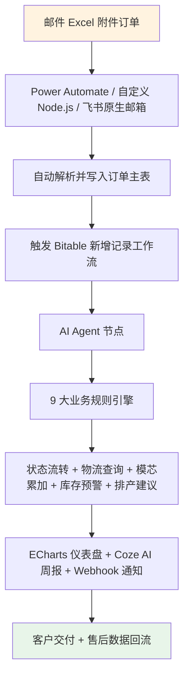
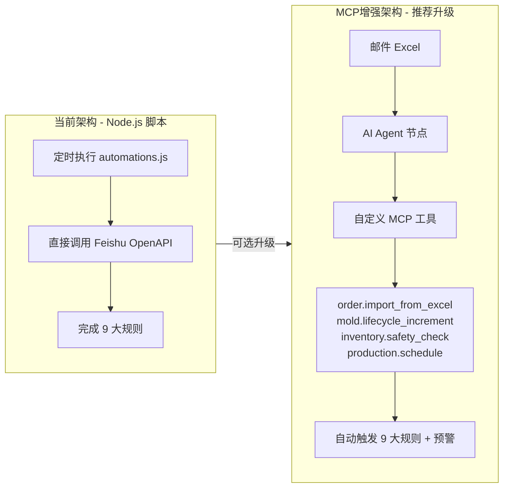
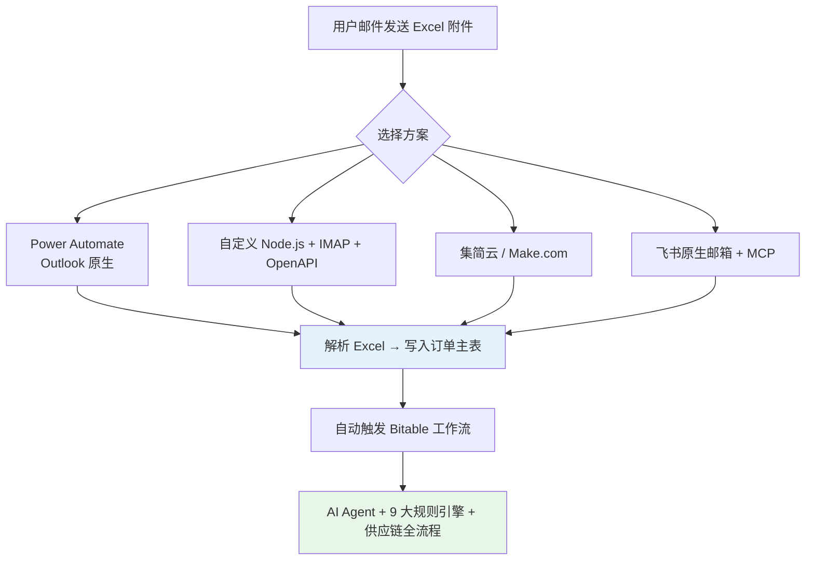

# Feishu 眼镜供应链智能系统 - 对话关键信息总结

**文档版本**：v1.1（含完整 Mermaid 图）  
**生成日期**：2026年3月28日  
**项目背景**：用户通过飞书企业版搭建眼镜片/眼镜零售端到端订单交付系统（生产环节外包），并结合 Node.js 自动化套件实现全供应链管理（模具、毛坯、成品库存、排产、采购、AI 分析）。  
**年订单量**：约 3 万单（日均 ≈ 82 单）  
**核心目标**：邮件 Excel 附件订单 → 自动导入 → 触发完整供应链规则引擎 → 交付跟踪 + 业务预警

## 1. 项目核心架构（基于两份核心文档）
- **feishu-setup-summary.md**：Node.js 自动化套件（12 张 Bitable 表、9 大可配置业务规则、SKU ABC-XYZ 分类、模具生命周期管理、Coze AI 周报、ECharts 仪表盘）。
- **供应链全流程图_提效与竞争力.md**：端到端供应链战略蓝图（上游模具+毛坯限速步骤、中游成品生产、下游订单交付），采用推拉结合 + AI 全链路介入策略。
- **技术栈**：Node.js 18+、Feishu OpenAPI、Bitable、Coze API、ECharts。
- **9 大业务规则**：全部配置化（规则配置表），支持业务用户自助调整，无需改代码。
- **当前代码状态**：Claude Code 编辑的纯 Node.js 脚本（`setup_tables.js`、`automations.js` 等），**尚未使用 MCP**。

## 2. 飞书企业版端到端流程设计

- **数据表结构**（5 张核心表）：
  - 订单主表（核心）
  - 客户/处方表
  - 成品库存表
  - 物流跟踪表
  - 销售预测/分析表
- **高级用法**：AI 配置高级权限、公式/AI 字段、仪表盘 TopN 统计、记录归档（保持热数据轻量）。

## 3. MCP（Model Context Protocol）说明

- **定义**：飞书工作流中 AI Agent 节点的“工具扩展协议”，允许 Agent 自主调用自定义工具。
- **当前项目状态**：**未使用 MCP**（当前架构为 Node.js 脚本直接调用 OpenAPI，已可完整实现所有功能）。
- **可选升级价值**：将自动化升级为“AI Agent 自主决策”模式，尤其适合邮件 Excel 自动解析 + 规则引擎触发。
- **推荐扩展工具**（可立即实现）：
  - `order.import_from_excel`（邮件 Excel 解析并创建订单）
  - `mold.lifecycle_increment`（模芯使用次数累加 + 三级预警）
  - `inventory.safety_check`（毛坯/成品安全库存计算 + 采购触发）
  - `production.schedule`（自动排产 + 车房分配）

## 4. 邮件 Excel 附件订单导入方案

- **无缝衔接点**：导入成功后自动触发 Bitable“新增记录”工作流 → AI Agent / 9 大规则引擎全部自动执行。

## 5. 关键决策记录
- 生产端已明确**外包**，重点聚焦零售端订单到交付 + 全供应链智能化管理。
- 飞书企业版完全满足 3 万单规模（容量、并发、AI 额度均充足）。
- 当前代码无需立即引入 MCP，但若希望实现“邮件 → AI Agent 自主处理”的无人值守模式，可在现有 Node.js 项目中扩展自定义 MCP。

## 6. 下一步行动建议
1. 确认是否需要扩展自定义 MCP（提供完整代码模板）。
2. 审查具体 JS 文件（`automations.js`、`setup_tables.js` 等）。
3. 实现邮件 Excel 自动导入 + 9 大规则引擎打通。
4. 优化仪表盘 / AI 周报与供应链全流程图的集成。

**文档关联**：
- `feishu-setup-summary.md`
- `供应链全流程图_提效与竞争力.md`
- 项目路径：`C:\Users\wangc\Downloads\ClarkWangVision\04-供应链\feishu-setup\`

---

*此文档由 Grok 根据完整对话自动生成（v1.1 已包含所有 Mermaid 图），可直接复制保存到项目根目录或 `docs/` 文件夹。*