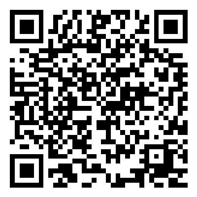
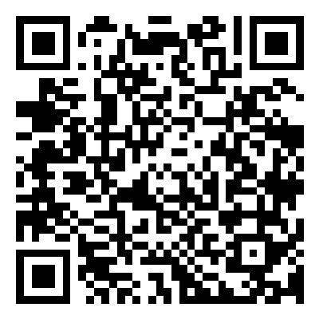

# QR 溯源验真系统 — 完整端到端报告

> 测试日期：2026-04-12
> 订单号：`ORD-20260412-V2CDH8`
> 代理商：北京明视眼镜（AG-003）

---

## 全流程

```
代理商下单 → 助理确认 → 生成镜片码+QR → 导出工厂包 → 消费者扫码验真
```

---

## 1. 代理商下单

通过代理商门户 `/order?t=AG-003-xxx` 提交订单：

| 字段 | 值 |
|------|------|
| 订单号 | `ORD-20260412-V2CDH8` |
| 顾客 | 李雪梅 |
| 产品 | Ultra |
| 收货地址 | 北京市朝阳区建国路89号华贸中心 |
| 交期 | 有货3天（承诺 2026/04/15） |
| 镜片数 | 2片 |

**API 调用：**
```bash
POST /api/submit?t=AG-003-xxx
# → { "success": true, "orderNo": "ORD-20260412-V2CDH8" }
```

### 处方参数

| 眼别 | 球镜 SPH | 柱镜 CYL | 轴位 AXIS | 瞳距 PD | 瞳高 PH | 镜框 |
|------|----------|----------|-----------|---------|---------|------|
| 右眼 | -5.25 | -1.50 | 175° | 31mm | 24mm | 雷朋 RB5154 |
| 左眼 | -4.75 | -1.25 | 10° | 31mm | 24mm | 雷朋 RB5154 |

---

## 2. 助理确认订单

助理在追踪页 `/track?t=AG-003-xxx` 查看待处理订单，点击「确认订单」。

系统自动执行：
1. 为每个镜片生成 16 位唯一镜片码（`crypto.randomBytes(8)`）
2. 写入飞书订单表 `镜片码` 字段
3. 订单状态 `待处理` → `生产中`
4. 生成 QR 码 PNG（内容指向验真 URL）

**API 调用：**
```bash
POST /api/order/ORD-20260412-V2CDH8/confirm?t=AG-003-xxx
# → { "success": true, "lensCodes": ["A3C99FA3AF3D2BDD", "A27EE7DF49520728"] }
```

### 生成的镜片码

| 眼别 | 镜片码 | 验真 URL |
|------|--------|----------|
| 右眼 | `A3C99FA3AF3D2BDD` | `/verify/A3C99FA3AF3D2BDD` |
| 左眼 | `A27EE7DF49520728` | `/verify/A27EE7DF49520728` |

---

## 3. QR 码

确认后自动生成 QR 码，每个镜片一个。扫码内容为验真 URL。

### 右眼镜片码



**`A3C99FA3AF3D2BDD`**

扫码内容：`https://<server>/verify/A3C99FA3AF3D2BDD`

### 左眼镜片码



**`A27EE7DF49520728`**

扫码内容：`https://<server>/verify/A27EE7DF49520728`

---

## 4. 工厂导出包

点击「导出工厂包」下载 ZIP（34KB），工厂可直接使用。

### ZIP 包内容

```
factory-ORD-20260412-V2CDH8.zip (34,515 bytes)
├── 订单_ORD-20260412-V2CDH8.xlsx          (18,300 bytes)  ← Excel 订单数据
├── qrcodes/
│   ├── A3C99FA3AF3D2BDD.png               (3,310 bytes)   ← 右眼 QR
│   └── A27EE7DF49520728.png               (3,290 bytes)   ← 左眼 QR
├── labels/
│   ├── ORD-20260412-V2CDH8_李雪梅_左眼.html  (4,057 bytes)   ← 可打印标签
│   └── ORD-20260412-V2CDH8_李雪梅_右眼.html  (4,045 bytes)   ← 可打印标签
└── 说明.txt                                  (649 bytes)
```

### Excel 字段（14列）

| A | B | C | D | E | F | G | H | I | J | K | L | M | N |
|---|---|---|---|---|---|---|---|---|---|---|---|---|---|
| 订单号 | 顾客 | SKU | 数量 | 眼别 | 球镜SPH | 柱镜CYL | 轴位AXIS | 瞳距 | 瞳高 | 镜框型号 | 镜片码 | 交期类型 | 收货地址 |

工厂可将 Excel 直接导入排产系统。

### 可打印标签

HTML 格式标签，浏览器打开后 `Cmd+P` 即可打印到 6cm×3cm 标签纸：

- QR 码内嵌为 base64 data URL，完全自包含
- 左侧 QR，右侧：订单号 + 顾客+眼别 + SKU+SPH+CYL+AXIS + 镜片码 + 品牌标识
- `@page { size: 6cm 3cm }` 适配热敏标签纸

---

## 5. 消费者扫码验真

### 5.1 正品验证 — 右眼（`A3C99FA3AF3D2BDD`）

消费者扫描右眼镜片上的 QR 码：

| 字段 | 值 |
|------|------|
| 验证结果 | **正品验证通过** |
| 订单号 | `ORD-20260412-V2CDH8` |
| 顾客姓名 | 李雪梅 |
| 产品型号 | Ultra |
| 下单日期 | 2026/04/12 |

**处方参数：**

| 眼别 | 球镜 SPH | 柱镜 CYL |
|------|----------|----------|
| 左眼 | -4.75 | -1.25 |
| 右眼 | -5.25 | -1.50 |

**API 调用：**
```bash
GET /verify/A3C99FA3AF3D2BDD
# → HTTP 200, "正品验证通过"
```

### 5.2 正品验证 — 左眼（`A27EE7DF49520728`）

| 字段 | 值 |
|------|------|
| 验证结果 | **正品验证通过** |
| 订单号 | `ORD-20260412-V2CDH8` |
| 顾客姓名 | 李雪梅 |
| 产品型号 | Ultra |

```bash
GET /verify/A27EE7DF49520728
# → HTTP 200, "正品验证通过"
```

### 5.3 无效镜片码测试

使用不存在的镜片码访问验真页面：

```bash
GET /verify/DEADBEEF12345678
# → HTTP 404, "未找到记录"
```

| 字段 | 值 |
|------|------|
| 验证结果 | **未找到记录** |
| 提示 | 此镜片码未在系统中登记，请联系销售商确认产品真伪 |

---

## 状态流转

```
  代理商下单          助理确认           工厂生产         发货签收
  ─────────────    ─────────────    ─────────────    ─────────────
  待处理  ──────→  生产中  ──────→  已发货  ──────→  完成
    │                │
    │ 2026-04-12     │ 2026-04-12
    │ 李雪梅下单      │ 生成2个镜片码
    │ 2片 Ultra      │ QR 自动生成
                     │ 状态写入飞书
```

---

## API 端点一览

| 端点 | 方法 | 说明 | 本次调用结果 |
|------|------|------|-------------|
| `/api/submit` | POST | 代理商下单 | 200, 生成订单号 |
| `/api/order/:orderNo` | GET | 订单详情 | 200, 处方完整 |
| `/api/order/:orderNo/confirm` | POST | 确认订单 | 200, 生成2个镜片码 |
| `/api/order/:orderNo/lens-codes` | GET | 查询镜片码 | 200, 返回列表 |
| `/api/order/:orderNo/qrcode` | GET | 下载 QR | 200, 3.3KB PNG |
| `/api/order/:orderNo/factory-zip` | GET | 导出工厂包 | 200, 34KB ZIP |
| `/verify/:lensCode` | GET | 消费者验真 | 200/404 |

---

## 技术实现

| 项目 | 实现方式 |
|------|----------|
| 镜片码 | `crypto.randomBytes(8)` → 16位大写十六进制 |
| QR 生成 | `qrcode` npm 包（纯 JS，400×400 PNG） |
| Excel | `xlsx` npm 包，14列处方+镜片码 |
| 标签 | HTML 格式，QR base64 内嵌，`@media print` 优化 |
| 工厂 ZIP | 手写 ZIP（Store 模式 + CRC32），零外部依赖 |
| 验真页面 | 纯 HTML/CSS，`{{FOUND}}` 控制正品/未找到状态 |
| 认证 | 验真页面无 auth（消费者公开访问） |
| 数据源 | 飞书多维表格 `镜片码` 字段精确匹配 |

---

## 验证结果汇总

| 测试项 | 结果 |
|--------|------|
| 代理商下单 | ✅ 订单写入飞书 |
| 助理确认订单 | ✅ 状态变为生产中 |
| 镜片码生成 | ✅ 2个唯一16位码 |
| QR PNG 生成 | ✅ 400×400 PNG |
| Excel 导出 | ✅ 18KB，14列完整 |
| HTML 标签 | ✅ 4KB，QR+处方文字 |
| 工厂 ZIP 导出 | ✅ 6文件，34KB |
| 正品验真（右眼）| ✅ 正品验证通过 |
| 正品验真（左眼）| ✅ 正品验证通过 |
| 无效码验真 | ✅ 未找到记录 |
| 手机扫码 | ✅ tunnel 可访问 |
